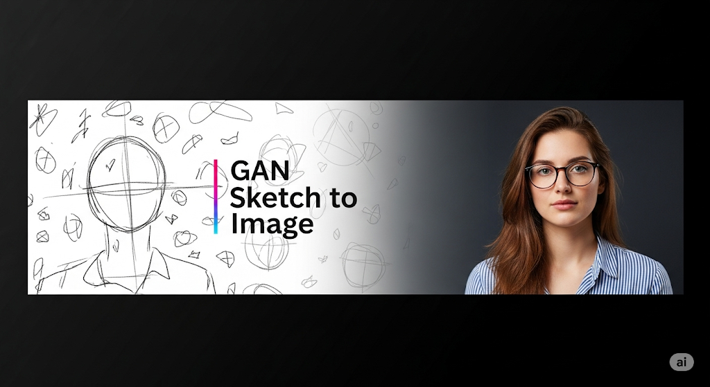

# 🖌️ GAN Sketch to Image

<p align="center">
  
</p>

<p align="center">
  
  
  
</p>

<h2 align="center">Turn your sketches into stunning, realistic images with AI ✨</h2>

---

## 📝 Project Overview

**GAN Sketch to Image** is a deep learning project that transforms hand-drawn sketches into photorealistic images using a Generative Adversarial Network (GAN). The project features a user-friendly web interface where users can upload their sketches and instantly receive AI-generated images. It is designed for artists, designers, and anyone interested in creative AI applications.

- **Purpose:** Bridge the gap between imagination and reality by converting simple sketches into detailed images.
- **Audience:** Artists, students, researchers, and AI enthusiasts.
- **Model:** Trained on paired sketch-photo datasets, leveraging state-of-the-art GAN architectures.

---

## 🧰 Technology Stack

<p align="center">
  
  
  
  
  
  
</p>

- **Python:** Core programming language for backend and data processing.
- **TensorFlow:** Deep learning framework for building and training the GAN model.
- **OpenCV:** Image processing and manipulation.
- **Flask:** Lightweight web framework for serving the application.
- **NumPy:** Efficient numerical computations and array operations.
- **Matplotlib:** Visualization of training progress and results.
- **TQDM:** Progress bars for data processing scripts.

---

## ⚙️ How It Works

1. **User uploads a sketch** via the web interface.
2. **Preprocessing:** The sketch is resized and normalized using OpenCV and NumPy.
3. **Prediction:** The pre-trained GAN model (TensorFlow/Keras) generates a photorealistic image from the sketch.
4. **Postprocessing:** The output is converted to a displayable image and shown alongside the input.
5. **Result:** The user can view and download the generated image.

---

## ✨ Features

- 🎨 **Sketch to Photo:** Upload a sketch and generate a realistic photo
- ⚡ **Fast Web Interface:** Interactive, modern UI (Flask)
- 🧠 **Deep Learning:** Powered by TensorFlow and OpenCV
- 🗂️ **Batch Processing:** Utilities for dataset/image handling
- 💎 **Beautiful Results:** See your art come to life!


## 📦 Installation

1. **Clone the repository:**
   ```bash
   git clone https://github.com/yourusername/gan-sketch-to-image.git
   cd gan-sketch-to-image
   ```
2. **Install dependencies:**
   ```bash
   pip install -r requirements.txt
   ```
3. **Add your trained model:**
   - Place your `best_model.keras` file in the project root.

---

## 🖼️ Usage

1. **Start the web app:**
   ```bash
   python app.py
   ```
2. **Open your browser:**
   - Go to [http://127.0.0.1:5000](http://127.0.0.1:5000)
3. **Upload a sketch:**
   - Click 'Choose File', select your sketch, and hit 'Generate Photo'.
4. **View results:**
   - See your input and the generated image side by side!

---

## 🛠️ Project Structure

```
GAN Sketch to Image/
├── app.py                # Flask web app
├── convert.py            # Batch image utilities
├── sketch-to-image.ipynb # Model training & experiments
├── static/               # CSS, uploads, predicted images
├── templates/            # HTML templates
└── requirements.txt      # Dependencies
```

---

## 📸 Gallery
<p align="center">
  
  
</p>

---

## 🤝 Contributing

Pull requests are welcome! For major changes, please open an issue first to discuss what you would like to change.

---

## 📄 License
[MIT](LICENSE)

---

<p align="center">
  <b>Made with ❤️ for creative AI art!</b>
</p> 
